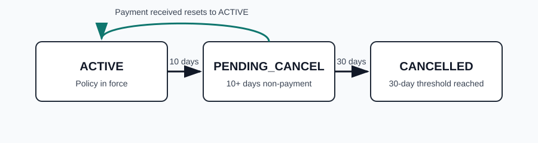

Policy cancellation is triggered when a billing cycle remains unpaid past the grace period and no approved exception is active.

## Rules

If a payment remains unresolved for 10 days after due date, policy status changes from ACTIVE to PENDING_CANCEL.

If payment is received while status is PENDING_CANCEL, status returns to ACTIVE and cancellation timer is cleared.

After 30 days in PENDING_CANCEL without payment, status changes to CANCELLED.

## Examples

An AUTO policy with a due date of 2026-02-01 receives no payment until 2026-02-14, so it becomes PENDING_CANCEL on 2026-02-11 and returns to ACTIVE on payment.

A HOME policy due 2026-01-01 receives no payment by 2026-01-31, so it transitions from ACTIVE to PENDING_CANCEL to CANCELLED.
